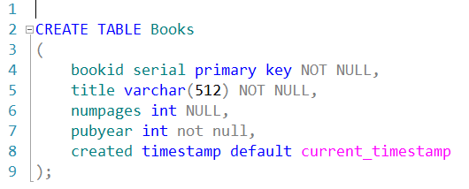
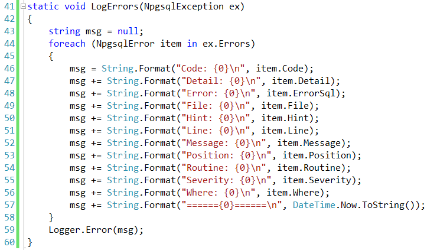
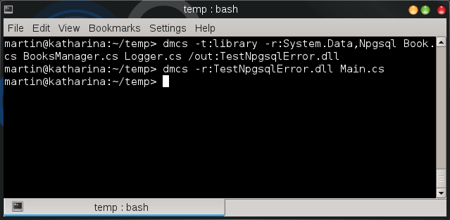
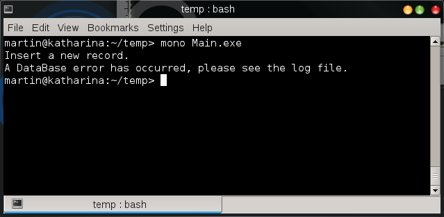
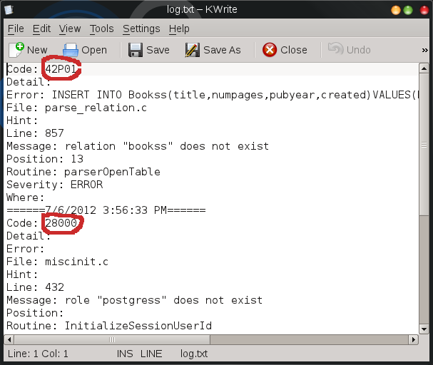

# Utilizando la clase NpgsqlError de la enumeración NpgsqlException.Errors
        

Una forma precisa de diagnosticar los errores <a href="http://www.postgresql.org/">PostgreSQL</a> en una aplicación :NET es mediante el uso de la clase NpgsqlError de la cual se pueden obtener detalles adicionales a la excepción generada esta  clase esta incluida en la enumeración Errors la cual al recorrerse y consultar las propiedades de la clase NpgsqlError podemos obtener información específica acerca de los errores y advertencias que se generan al ejecutar los comandos SQL o Store procedures en PostgreSQL por medio de una aplicación .NET que haga uso del driver <a href="http://npgsql.projects.postgresql.org/">Npgsql</a>.

A continuación mostramos una aplicación de consola que se conecta a una base de datos PostgreSQL, ejecuta un comando SQL para crear un nuevo registro en una tabla y envia la excepción generada hacia un archivo de texto.

 
Aquí el código para crear la tabla <b>Books</b>

            <!--Code -->

            En la clase <em>BooksManager</em>  se encuentra el método estático <em>LogErrors</em> en donde se realiza toda la funcionalidad, aquí es donde se itera por la enumeración Errors de la clase NpgsqlException y se escribe la información en el archivo de texto. 

            

 

Antes de compilar y ejecutar la aplicación vamos a ocasionar un error en la sentencia de la consulta SQL. Por ejemplo no escribir correctamente el nombre de la tabla.
 
<pre>
var commandText = "INSERT INTO Books(title,numpages,pubyear,created)
VALUES(:title, :numpages, :pubyear, :created)"; 
</pre>
            <!--Code-->
            
Al compilar y ejecutar la aplicación veremos la excepción generada a propósito para poder consultar el archivo log y ver más detalles acerca de la excepción generada. Compilamos la aplicación con los siguientes comandos: 

            <!--Code-->
            <pre>
            <tt>$ dmcs -t:library -r:System.Data,Npgsql Book.cs BooksManager.cs Logger.cs  /out:TestNpgsqlError.dll</tt> <tt>$ dmcs -r:TestNpgsqlError.dll Main.cs</tt> 
            </pre>
            <!--Code-->
            

            
Ejecutamos la aplicación, como se muestra en la siguiente imagen: 

            

Otra prueba es si escribimos erróneamente los parámetros de la cadena de conexión, por ejemplo cambiar el usuario de la base de datos o no teclear correctamente el nombre de la base de datos.

 
<pre>
string connStr = "Server=127.0.0.1;Port=5432;Database=testBooks;User ID=postgressss;Password=Pa$$W0rd";
</pre>

Podemos consultar la bitácora y ver como por cada excepción se genera un código y los detalles de la excepción.

